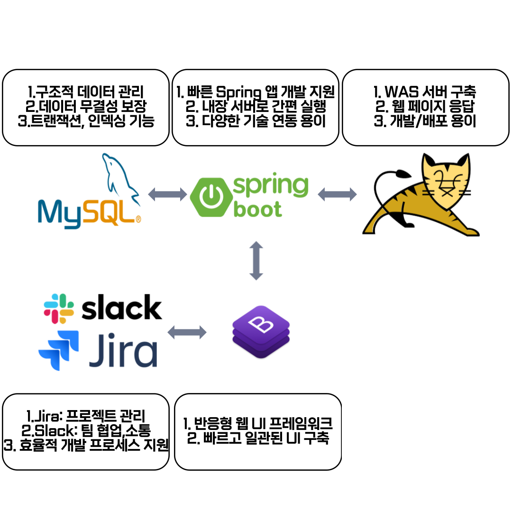
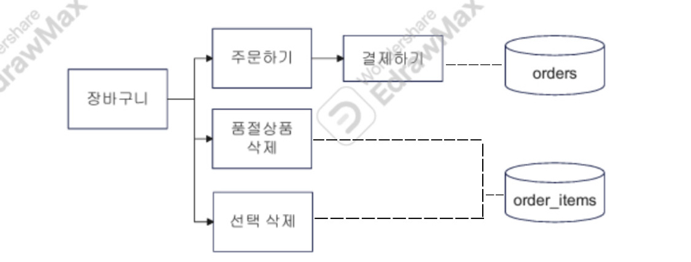
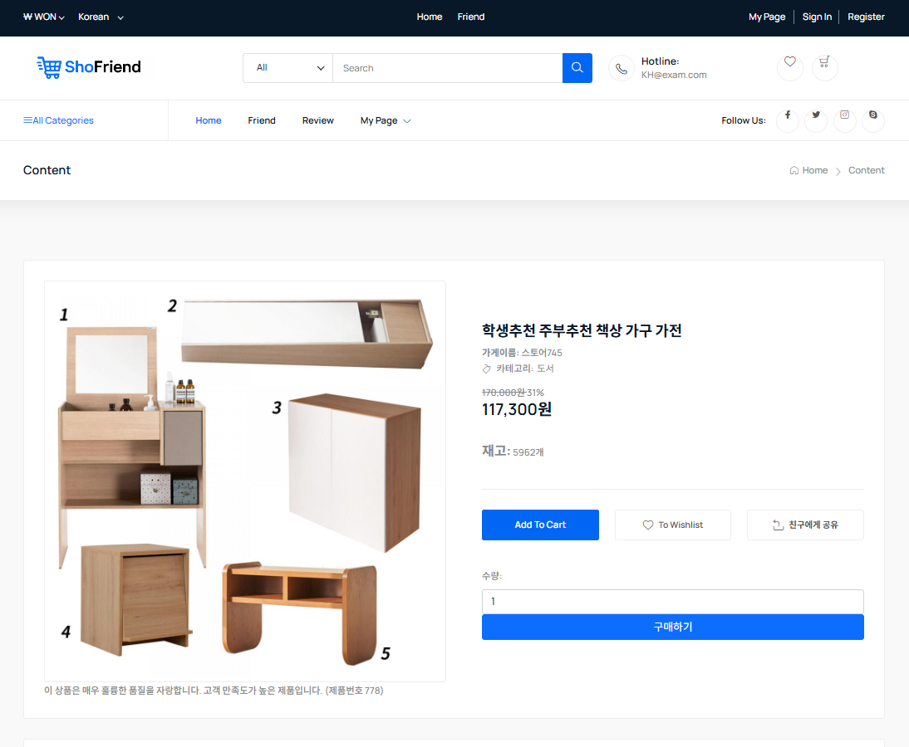
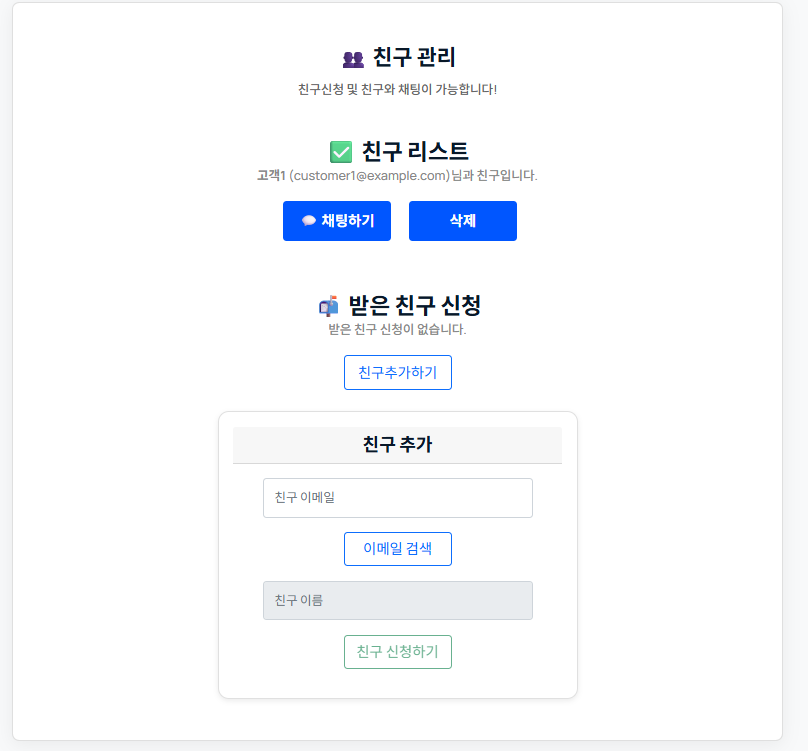
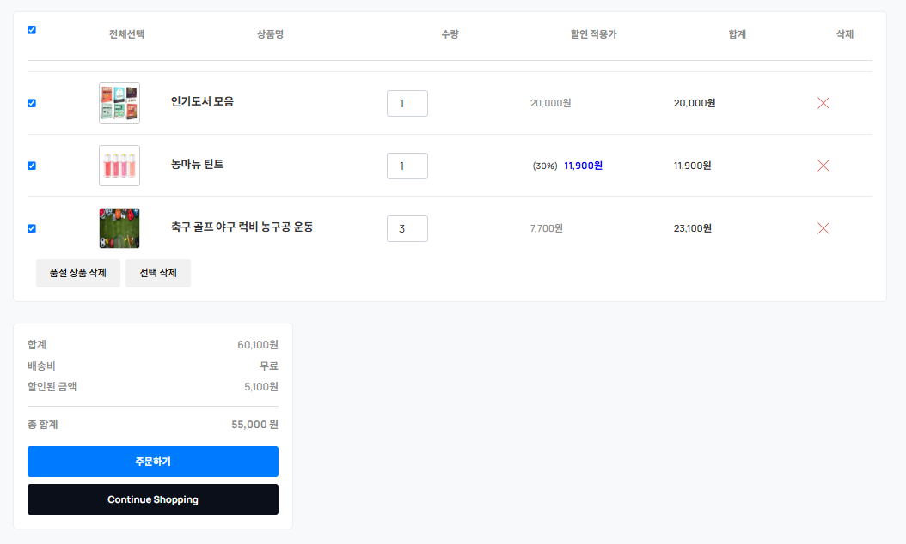
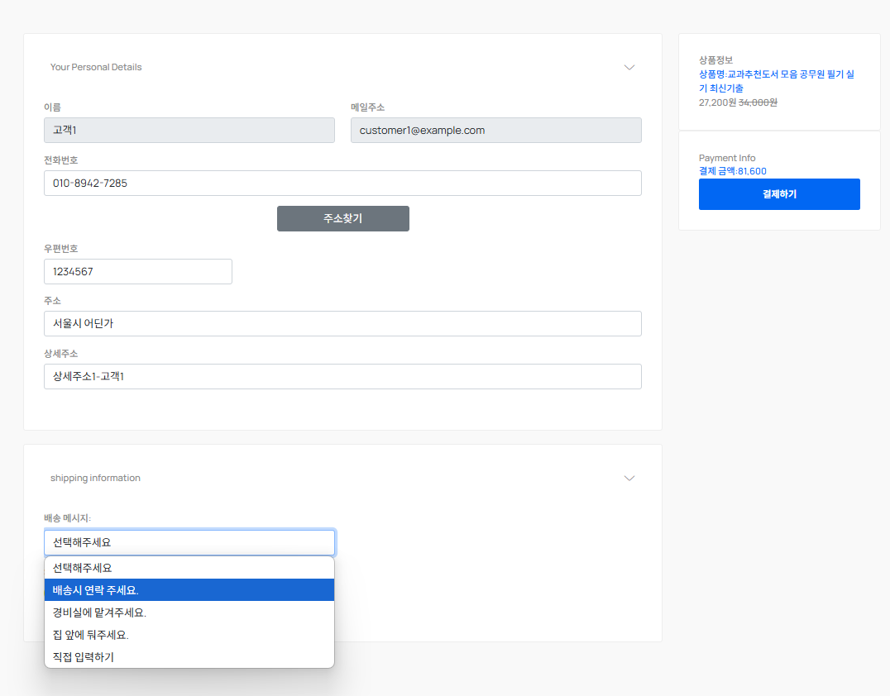

# 🛍️ 친구와 함께 쇼핑해요! SHOFRIEND

**Spring Boot 기반 온라인 상품 판매 플랫폼**
 

빅데이터 기반(파이썬·자바·웹) 엘라스틱 검색엔진 개발자과정 `2025. 01. 15 ~ 2025. 07. 10`

 

1조 3차 프로젝트 진행 기간 `2025. 05. 07 ~ 2025. 05. 14`

## 프로젝트 포스터

## 💡 프로젝트 선정 배경

본 프로젝트는 **소셜 네트워킹 서비스(SNS)의 연결성과 커뮤니티 기능**과 **온라인 쇼핑몰의 편리한 상품 구매 경험**을 융합하여 새로운 형태의 온라인 플랫폼을 구축하고자 하는 아이디어에서 시작

- 친구의 쇼핑 경험을 공유, 함께 상품을 추천, 관심사를 기반으로 새로운 관계를 형성, 공동 구매를 통해 혜택을 누리는 등 기존 쇼핑몰에서는 경험하기 어려웠던 **소셜 쇼핑의 가치**를 제공

- **SNS와 쇼핑몰의 강점을 결합**하여 사용자들에게는 더욱 풍부하고 즐거운 온라인 쇼핑 경험을 제공하고 판매자에게는 새로운 마케팅 및 판매 채널 제시

## 기술 구상도

  ### 사용 기술 스택
  * **Backend:** Spring Boot
  * **Database:** MySQL
  * **ORM:** MyBatis
  * **Version Control:** Git, Sourcetree
  * **Build Tool:** Gradle
  * **Web Server:** Tomcat
  * **Communication:** Slack, Jira

## 설계

### DB diagram을 사용한 erd 테이블 설계

### 업무 흐름도
<table>
  <tr>
    <td align="center">메인</td>
    <td align="center">마이페이지</td>
    <td align="center">장바구니</td>
  </tr>
  <tr>
    <td></td>
    <td></td>
    <td></td>
  </tr>
</table>

### 서비스 설계단 흐름
<table>
  <tr>
    <td align="center">사용자</td>
    <td align="center">친구</td>
  </tr>
  <tr>
    <td></td>
    <td></td>
  </tr>
</table>

## 🚀 주요 기능

### 사용자

  * **🔍 (헤더) 상품 검색:** 헤더의 검색창을 통해 원하는 상품을 무슨 페이지에서든 검색
  * **👤 (헤더) 로그인 및 회원 정보:** 사용자 인증 및 개인 정보 관리  
  * **🛒 (헤더) 장바구니:** 관심 있는 상품을 담고 한 번에 결제
  * **💳 결제:** 카카오페이를 통한 결제 시스템 지원
  * **⭐ 리뷰:** 상품에 대한 사용자들의 후기를 확인하고, 작성
  * **🏷️ 카테고리:** 카테고리별 상품 목록 탐색, 검색, 정렬, 페이징

### 판매자

  * **🏪 점포 등록,수정:** 판매자 자신의 상점 개설, 정보 관리
  * **📝 상품 리스트 관리:** 등록된 상품 목록 확인, 수정, 삭제

### 소셜

  * **🧑‍🤝‍🧑 친구 추가 및 삭제:** 사용자 사이에 친구를 맺고 관리
  * **💬 친구 채팅:** 친구와 실시간 채팅 지원
  * **🎁 친구 추천 상품:** 친구가 구매한 상품기반 맞춤형 상품 추천
  * **🎁 친구 상품 공유:** 상품 링크 공유

## ⏳ 추후 구현 예정

다음과 같은 기능들이 추가로 구현될 예정

### 소셜 기능 강화

  * **🤝 공동구매:** 친구와 함께 상품을 구매가능, 할인 혜택 등 지원
  * **👀 실시간 친구 쇼핑:** 친구가 현재 어떤 상품을 보고 있는지 실시간으로 확인 (예: "OO님이 이 상품을 보고 있어요!")
  * **🧑‍🤝‍🧑 관심사 기반 친구 추천:** 사용자의 관심사를 분석해 새로운 친구 추천
  * **🔔 알림 기능:** 친구 활동, 이벤트 정보, 상품 업데이트 등 다양한 알림 제공
  * **Wish List 공유:** 서로의 Wish List를 확인하고 관심사를 공유

### 사용자 편의 기능 강화

  * **🔑 소셜 로그인:** Google, Kakao 등 다양한 플랫폼 계정을 통해 간편하게 로그인할 수 있도록 지원
  * **❤️ 찜 기능:** 관심 있는 상품을 찜 목록에 추가, 찜 목록을 기반으로 개인화된 상품 추천(추천 알고리즘 로직 적용 예정)
  * **🎁 개인화된 상품 추천 강화:** 사용자들의 구매, 검색, 찜 목록 등을 분석하여 더욱 정확하고 다양한 상품을 추천

### 보안 강화

  * **🛡️ 보안 기능 강화:** Spring Security, JWT (JSON Web Token) 등을 활용해 사용자 데이터, 시스템 보안강화 예정

## 협업툴 자동화 활용

  <table>
    <tr>
      <td align="center">slack</td>
      <td align="center">jira</td>
    </tr>
    <tr>
      <td></td>
      <td></td>
    </tr>
  </table>

## 결과

  ### 메인 화면
  
  
  ### 상품 상세
  
  ### 리뷰
  
  ### 친구
  
  
  ### 결제
  
  
  

## 📜 프로젝트 후기 

  * **팀장(우주연):** 구현하고 싶었던 기능들이 많은데 전부 다 완성하지 못해서 아쉬웠지만, 제작한 백앤드 기능들이 계획한대로 동작하게끔 만들어져 얻어가는게 많은 프로젝트라고 생각됩니다. 다음 프로젝트에는 ai를 활용한 기능들을 추가해 보고 싶고, 로그인 기능을 만들게 된다면 Spring Security를 활용한 보안을 적용해 보고 싶습니다!
  * **팀원(권준우):** WebSocket을 이용한 채팅 기능을 처음 시도해봤는데, 잘 작동되도록 구현한것 같아 만족스럽습니다. 시간이 부족해 초반에 계획했던 보안쪽 설계 시도를 하지 못해 아쉬었지만, 프로젝트 자체는 수업시간에 배웠던 대부분의 기능을 직접 다루고 적용해 볼 수 있어서 많이 배울 수 있는 기회가 되었습니다!
  * **팀원(김채윤):** 구현하고 싶었던 기능들이 많았지만 모두 완성하지 못해 아쉽습니다. 그러나 친구와 함께 쇼핑한다는 초기 기획과 함께 일반적인 웹사이트와는 차별화된 웹페이지를 만들 수 있었습니다. 신선한 프로젝트에 참여하여 매우 뜻깊은 시간이었습니다!
  * **팀원(성유리):** 기능 구현을 이행하기에 시간이 걸려, 많이 하지 못한부분은 아쉽습니다.  전 프론트단을 디자인하는데 코드가 너무 많아져 추후 추가 기능, 프론트 쪽은 타입스크립트나 리액트사용 에 집중하고싶습니다 . 팀원들이 잘해주셔서 잘 마무리 한 것 같습니다!

## 🔗 관련 링크
  * **GitHub Repository:** 
  [[팀장 우주연-GitHub Repository URL](https://github.com/Wjyuy/Shofriend_boot)]
  [[팀원 성유리-GitHub Repository URL](https://github.com/yuriuser126/ShoFriend_project3)]
  [[팀원 김채윤-GitHub Repository URL](https://github.com/Chaeyoon-k/pilotproject_03)]
  [[팀원 권준우-GitHub Repository URL](https://github.com/kjo5191/ShoFriend)]
  * **API 문서:** [[카카오페이 API URL](https://developers.kakaopay.com/)]
  * **API 문서:** [[카카오 API URL](https://apis.map.kakao.com/)]
  * **Jira 프로젝트:** [[Jira 프로젝트 URL](https://khproject3.atlassian.net/)]
  * **Slack 채널:** [[Slack 채널 URL](https://khproject3hq.slack.com/)] 

  * **발표자료**

  <a href="./img/pptx.pdf" download="document.pdf">PDF 미리보기</a>
  [최신 발표 자료 다운로드 (릴리스)](https://github.com/Wjyuy/ShoFriend_Final/releases/latest)

  * **시연영상 보기**

  
